# Minisql实验报告

## Chapter 1 - 实验要求

### 1. 实验目的

​	设计并实现一个精简型单用户SQL引擎(DBMS)MiniSQL，允许用户通过字符界面输入SQL语句实现表的建立/删除；索引的建立/删除以及表记录的插入/删除/查找。

​	通过对MiniSQL的设计与实现，提高学生的系统编程能力，加深对数据库系统原理的理解。

### 2. 功能实现

​	本实验要求实现规定的基本数据类型与基本语法。本章节对实验需求和语法说明进行详细介绍

#### 2.1 实验需求

##### 2.1.1 数据类型

​	数据类型仅支持三种，分别为$int, char(n),float$，其中$1\leq n\leq 256$。本实验中默认一个$int$与$float$类型大小均为4字节。

##### 2.1.2 表定义

​	本实验一个表最多支持32个属性，各个属性可以指定是否为unique，并支持单属性的主键定义

##### 2.1.3 索引的建立与删除

​	对于表的主属性自动建立B+树索引，对于声明为unique的属性可以通过SQL语句由用户指定建立/删除B+树索引（因此，所有的B+树索引都是单属性单值的）。根据block size(4096)选择，N要计算出来。整数4个字节。B+树必须写到外存。

##### 2.1.4 查找记录

​	可以通过指定用and连接的多个条件进行查询，支持等值查询和区间查询。此外，本实验实现了where语句中的or连接。

##### 2.1.5 插入和删除记录

​	支持每次一条记录的插入操作；支持每次一条或多条记录的删除操作。

#### 2.2 语法说明

​	本小节介绍本数据库系统中支持的功能及其语法说明

##### 2.2.1 创建表

```sql
create table 表名 (
	列名 类型 ,
	列名 类型 ,
	
	列名 类型 ,
	primary key ( 列名 )
);
```

每张表最多支持32个属性值。对于每张表，创建时会自动对主键建立索引。创建表中支持unique关键字，并可在之后对unique属性建立索引。

若该语句执行成功，则输出执行成功信息；若失败则给出失败信息。

##### 2.2.2 删除表

```sql
drop table 表名 ;
```

该语句对名字为`表名`的表进行删除操作，同时删除对应的索引与catalog记录。

若该语句执行成功，则输出执行成功信息；若失败则给出失败信息。

##### 2.2.3 创建索引

```sql
create index 索引名 on 表名 ( 列名 );
```

若该语句执行成功，则输出执行成功信息；若失败则给出失败信息。

##### 2.2.4 删除索引

```sql
drop index 索引名 ;
```

若该语句执行成功，则输出执行成功信息；若失败则给出失败信息。

##### 2.2.5 选择语句

```sql
select * from 表名 ;
select * from 表名 where 条件 ;
select * from 表名 where 条件1 or 条件2;
```

其中“条件”具有以下格式：列 op 值 and 列 op 值 … and 列 op 值。

op是算术比较符：=  <>   <    >    <=   >=

若该语句执行成功且查询结果不为空，则按行输出查询结果，第一行为属性名，其余每一行表示一条记录；若查询结果为空，则输出信息告诉用户查询结果为空；若失败则给出失败信息。

##### 2.2.6 插入记录

```sql
insert into 表名 values ( 值1 , 值2 , … , 值n );
```

若该语句执行成功，则输出执行成功信息；若失败则给出失败信息。

##### 2.2.7 删除记录

```sql
delete from 表名;
```

若该语句执行成功，则输出执行成功信息，其中包括删除的记录数；若失败则给出失败信息。

##### 2.2.8 退出MiniSQL系统语句

```sql
quit;
```

##### 2.2.9 执行脚本文件

```sql
execfile 文件名;
```

SQL脚本文件中可以包含任意多条上述8种SQL语句，MiniSQL系统读入该文件，然后按序依次逐条执行脚本中的SQL语句。


## Chapter 2 - 总体设计

### 1. 组员分工

张振宇：RecordManager + Interpreter + 测试 + 报告

徐巧颖：BufferManager + 报告

姜东甫：IndexManager + 报告

钟家伟：CatalogManager + API + 报告


### 2. 整体结构介绍

整个数据库的结构参照了实验指导部分，主体分为四个部分，分别是`RecordManager`, `BufferManager`, `IndexManager`和 `CatalogManager`. 


### 3. 流程图

以一条`insert`语句为例，下面是其经过的模块及相关处理：

```flow
flow
st=>start: insert tuple
ip=>operation: interpreter
err=>operation: report error
index=>operation: Index Manager
cond=>condition: success or failure?
end=>end
api=>operation: API 
rec=>operation: Record Manager
prt=>operation: PRINT
cond2=>condition: If find 
buf=>operation: Buffer Manager
disk=>operation: DISK 
st->ip->cond
cond(yes)->api->rec->buf->disk->end

cond(no)->err
```


### 4. 模块设计与简要概述


## Chapter 3 - 详细设计 

### 1. Interpreter

#### 1.1 模块功能介绍

​	Interpreter实现的基本功能是展现界面提示府，接受用户的指令，将用户的指令进行初步语法分割与翻译，根据指令类型，将翻译过的参数，送入不同的API函数中。其中Interpreter分为interpreter与Parser两部分，分别做打印提示符，分割与翻译的功能。

#### 1.2 具体流程与源码介绍

​	该模块的执行逻辑流程图如下：

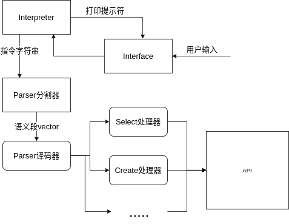

##### 1.2.1 Interface

Interface的实现依靠一个while循环，通过bool型State变量来决定提示符样式。利用try-catch语句块来捕捉程序错误（语法方面和其他方面），从而打印出来。

```cpp
string ins;
    static bool State = true;  //true
    while(1){
        if(State) cout<<"MiniSql> ";
        else      cout<<"       >";
        getline(cin,ins);
        if(ins=="quit"){
            cout << "Bye!" << endl;
            getchar();
            exit(0);
        }
        try{ 
            State = parser.input(ins);  //false stands for input continue
        }
        catch (std::runtime_error &error) {
            cout << "[Error] " << error.what() << endl;
            parser.flushBuffer();
            State = true;
        }
    }
```

##### 1.2.2 语义段分割

​	当string类型的语句进入Parser分割器之后，第一步将一些符号和字母分开，例如：select*from 应被处理为select    *     from，方法为在符号两侧位置添加空格。其中主要有* = < > ,  ; 等符号。

```cpp
for(int i=0; i<(int)input.length();i++){
        if(input[i]=='*'||input[i]=='='||input[i]=='<'||input[i]=='>'||input[i]==','
           ||input[i]=='('||input[i]==')'||input[i]==';'){
               if(input[i-1]!=' ') { input.insert(i," "); i++; }
               if(input[i+1]!=' '&&input[i+1]!='\0') { input.insert(i+1," "); i++; }
           }
    }
```

​	分割开符号与单词之后，我们就可以以空格作为分隔符将字符串分割开。利用istringstream类方法直接split开，存到vector<string\> buffer 中。其中buffer是Parser类的私有变量，起到缓冲的作用。因为一句指令可能需要多行指令组成，以分号作为结束符，所以指令要有缓冲区，每当遇到分号再进行一次译码。

```cpp
	istringstream split(input);
    vector<std::string> ins_s((istream_iterator<string>(split)),
                                    istream_iterator<string>());
    buffer.insert(buffer.end(),ins_s.begin(),ins_s.end());
```

​	译码器主要通过前两个单词来判断该条指令的类型，从而决定运用何种解释器来进行进一步翻译，这里运用穷举法，源码不再列出。

##### 1.2.3 具体语义分析

​	语义段传入到具体的解释器后，利用try-catch块捕捉错误，从头至尾扫描，不同的语句类型的解析大同小异，以比较复杂select语句翻译为例：	

​	select之后单词若为*，则为全部选择，若不为\*，则将select之后，from之前的单词作为所选的attributes的名字存入一个vector中。from之后的单词为tablename，tablename后的单词应该为where，where之后应该为不定数量的条件。若不为where且语句结束，则select没有条件。where之后的条件格式应为 attribute op sqlvalue，我们存储条件的数据类型是一个结构体，结构体由三个成员分别为表名，op（0-5）表示5种条件，sqlvalue（也是结构体，包含属性和值）。挨个向后扫描，按顺序读取name，op（判断一个一个还是两个字符 的类型），sqlvalue（指定属性的规则为有单引号和双引号的为字符串类型，有小数点的为float类型，纯数字为int类型）。然后判断连接条件为and还是or，从而决定选择的类型。当扫描到最后结束，将三个变量vector传入API，表名，属性名，条件。

​	在按一定的规则扫描中，如果遇到一点不符合预期的要求，视情况抛出runtime_error，默认为语法错误。

​	解释器仅仅具有解释语法的功能，对于其中表是否存在等条件，要在API中进行验证。

​	语义分析共有以下的函数：

```cpp
    void Create_table(vector<string> args);   //接收string类型的vector作为参量
    void Drop_table(vector<string> args);
    void Create_index(vector<string> args);
    void Drop_index(vector<string> args);
    void Select(vector<string> args);
    void Selectpart(vector<string> args);
    void Delete(vector<string> args);
    void Insert(vector<string> args);
```


##### 1.2.4 脚本执行逻辑

​	脚本执行的逻辑与其他解释不同，其流程为模拟一个创建一个Parser的对象，与interpreter类似的流程将脚本中的字符串输入。且在execfile创建的Parser对象中，bool变量outtime为false，即不输出每条指令的时间，仅输出脚本中所有的指令消耗的时间。

```cpp
void Parser::Execfile(vector<string> args){
    if(args.size()>2) { 
        throw std::runtime_error("SYNTAX ERROR: You have an error in your SQL syntax (execfile)");
    }
    Parser parser;
    parser.outtime = false;
    string ins;
    string filename=args.at(1);
    ifstream infile(filename);
    auto start_time = std::chrono::high_resolution_clock::now();
    while (getline(infile, ins)) {
       try{ parser.input(ins); }
       catch (std::runtime_error &error) {
            cout << "[Error] " << error.what() << endl;
            parser.flushBuffer();
        }
    } 
    auto finish_time = std::chrono::high_resolution_clock::now();
    long long int tempTime = std::chrono::duration_cast<std::chrono::nanoseconds>(finish_time - start_time).count();
    if (tempTime == 0) tempTime = 10;
    if(outtime) std::cerr << "(" << setiosflags(ios::fixed) << setw(9) << setprecision(9) << tempTime * 1e-9 << " s)" << std::endl;   
}
```


### 2. API

#### 2.1 模块功能介绍

​	API的功能为，接受Interpreter的指令信息，调用CatalogManager，RecordManager，IndexManger进行指令执行，对每一种不同的指令都有不同的执行流程。

#### 2.2 具体流程与源码介绍

​	API是一个“中转站”，主要作用就是联系各个模块，调用模块获取信息，将信息在模块之间传递等等。API是一个较为抽象的中间层，所以并没有形成一个类，而是一系列名为API的函数的合集，当然我们也可以用一个命名空间来储存。在API中有RecordManager类，CatalogManager类，IndexManager类的实例化对象作为全局变量，从而调用各个模块。

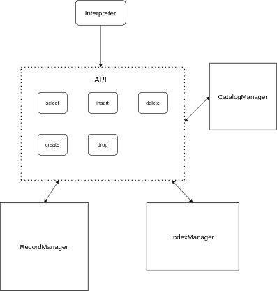

API.h 的构成如下：

 其中每个函数对应一类指令的调用和实现

```cpp
void API_create_table(string tablename,vector<attri_type>attris);
void API_drop_table(string tablename);
void API_create_index(string tablename,string indexname,string at_name);
void API_drop_index(string indexname);
void API_select(string tablename, vector<condition> conditions,int stype);
void API_selectpart(vector<string> attris, string tablename, vector<condition>           conditions,int stype);
void API_insert(string tablename,vector<sqlvalue> value_list);
void API_delete(string tablename,vector<condition> conditions); 
```


#### 2.3 各函数的执行逻辑 

建表函数将首先调用CatalogManager检查表名是否重复，再检查各Attribute是否符合一定的条件，即是否有主键且唯一，字符串长度是否合理等。处理完毕后就可以传给CatalogManager进行存储。

删表函数首先检查表名的存在性，然后先调用IndexManager和CatalogManager把对应表中的索引先全部删除，然后执行CatalogManager的删表函数，把表从文件中彻底删除。

创建索引函数先检查该表的对应属性上是否能够建立索引，然后调用IndexManager的建索引函数首先建一颗空的b+树。调用RecordManager将文件中所有block的记录取出，传入IndexManager中。

删除索引函数检查索引存在后直接调用Indexanager删除。

选择函数首先检查表是否存在，选择的属性是否存在，检查选择条件是否合理。其次检查选择条件中是否有能够利用索引来查找的值，有索引就用索引查找的方法，默认用第一个索引条件查询。

插入函数首先检查插入的表和元组，然后检查属性中是否有unique和primary类型，这两种类型在插入之前必须先判断有没有重复的值，在检查重复的时候，判断对应属性有没有索引，有索引就用索引判断重复，没有的话就用顺序查找。

删除函数与选择函数同理。


### 3. RecoredManager

#### 3.1 功能描述

RecordManager主要实现对于记录增删查的一类方法，用一个类来储存这些方法，类中并没有变量。主要的功能有创建和删除表文件，查找记录，插入记录，删除记录，创建索引。另外在每个模块中，都调用了IndexManager来实现所以索引的同步。

```cpp
class RecordManager{
public:
    //打印结果
    void print(const Result &res) const;   
    //检查元组是否符合条件
    bool validCheck(const vector<condition> conditions, const Tuple tu);
    bool orvalidCheck(const vector<condition> conditions, const Tuple tu);
    //给定块和offset，把一个tuple读出来
    void readTuple(const char *blockBuffer,int offset, const vector<attri_type> &attris, Tuple&tu);
    
public:
    //创建表文件
    bool createTable(const string tablename);
    //删除表文件
    bool dropTable(const string tablename);
    //查找记录,返回条数,无索引
    int  selectRecord(const Table &table, const vector<string> &attr, const vector<condition> conditions,bool output=false);
    int  selectRecord_or(const Table &table, const vector<string> &attr, const vector<condition> conditions,bool output=false);
    //查找记录，返回条数，有索引
    int  selectRecord_index(const Table &table, const vector<string> &attr, const vector<condition> conditions,const condition indexcon,bool output=false);
    //插入记录
    bool insertRecord(const Table &table, const Tuple &record);
    //删除记录
    bool deleteRecord(const Table &table, const vector<condition> conditions);
    //创建索引
    bool CreateIndex(const Table &table, const attri_type indexattr);
};

```

#### 3.2 具体流程与源码介绍

##### 3.2.1 处理内存辅助模块

处理内存的辅助模块主要是readTuple，validcheck，和print模块，这三个模块是实现的功能分别为：

ReadTuple接收内存块的首地址与该条记录的偏移量，获取表信息，通过各属性信息将该位置的信息读入一个类型为Tuple的复杂结构体变量中。

Validcheck函数利用传入的condition结构体和Tuple结构体进行条件是否符合的判定。

print函数能够将一个Tuple中的复杂类型转化为字符串以一定的格式打印在控制台上。

##### 3.2.2 增删查的实现方法

查找的函数有两种：有索引辅助和无索引辅助。无索引的查找会向BufferManager挨个请求每个存储记录信息的block，在每个block中以计算好的偏移量调用ReadTuple和ValidCheck进行挨个的读取和判定，输出所有的判定符合条件的结果，最后输出所有符合条件的记录的数量。

有索引的查找要先决定用哪个条件进行b+树搜索，将这个条件传入IndexManager获取符合这个条件的所有条件的 位置，然后根据这些位置，调用BufferManager获取相应的block，用已知的offset进行读取和另外条件的判定。这里索引查找仍有较大的优化空间，如可用两个索引同时查找取交集等方法来实现，但由于工作量过大没有进行优化。

插入函数的逻辑为，调用BufferManager获取最后的块，逐个检查位置是否被占用，如果全部位置都被占用，就再获取新的Block。将元组插入该位置，然后还要将这个元组和当前插入的BlockID和offset提供给IndexManager，将这个元组的位置信息存储到B+树中。

删除函数的逻辑与查找函数相同，从头到尾地搜索所有记录，删除符合条件的元组，然后将删除的值传给IndexManageer，在B+树中同步删除这个节点。

### 4.CatalogManager

### 5. IndexManager

#### 5.1 功能描述

Index Manager负责数据库中的索引，即数据库中索引的创建，删除，索引值的更新（插入、删除）等等。本实验设计的Index Manager通过类`IndexManager`实现对索引的控制。在整个程序中，Index Manager通过该接口类与API，Recorder Manger与Buffer Manager进行交互，实现索引功能，提高程序查找和运行的速度。

以下是`IndexManager`类的接口代码：

```cpp
//this class is the interface of the API, the highest level to control B+Tree
class IndexManager
{
    public:
        int n;//the number of table that has an index
        vector<TableIndex> TI;
        IndexManager();
        ~IndexManager();
        bool CreateIndex(const string &tablename, IndexInfo<int> &indexinfo);
        bool CreateIndex(const string &tablename, IndexInfo<float> &indexinfo);
        bool CreateIndex(const string &tablename, IndexInfo<string> &indexinfo);
        bool DeleteIndex(const string &tablename, const string &index_name);
        bool InsertKey(const string &tablename, vector<sqlvalue> index_value, const Position& p);
        bool DeleteKey(const string &tablename, vector<sqlvalue> index_value);
        vector<Position> GetPosition(const string &tablename, const condition &c);
        bool Save();
        //call the read every time program is executed
        bool Read();

    private:
        TableIndex *FindTable(const string &tablename);
        void Error();
};
```

#### 5.2 B+树实现逻辑

​	在数据库的B+树中，根据每次创建索引键值的最大长度，B+树会自动计算节点的阶。一般来讲，我们保证B+树的每个节点的字节大小在一个page左右，这与个人的定义有关。程序中，我们去一个page为$4KB$。因此每个节点阶的大小应该为：
$$
order = \frac{4096}{sizeof(key)+sizeof(child\ pointer)}
$$
其中每个键值在叶节点中还包括对应的位置，即$blockID$与$block \ offset$.

​	索引通过接口函数进行创建和删除。同时，每次在对disk的表中进行插入删除时，均需要对该表的索引进行更新。

​	在查找中，Index Manager接口API传入的比较信息，在对应的B+树中进行搜索，并返回所有满足条件的B+树的位置信息，并提供给Record Manager进行调用，以加快搜索速度。

​	实际的测试表明，100000量级的数据，计算出的B+树一般为3层，40000及以下量级的数据创建的B+树一般为2层。这有效保证了B+树的高搜索效率，提高了数据查找的速度。 


### 6. BufferManager

#### 6.1 功能描述

本模块为record Manager提供可读写的块。在底层实现软硬件交互，通过内存池的引入加快了record manager的查找速度，同时write through机制的引入避免了系统故障而导致的数据丢失。


#### 6.2 数据结构

主要用了block类实现单个block的管理：

```c++
// 读内存块的时候，默认的是char(n)类型的要存n+1个字节
class Block
{
/* 我们定义磁盘上最前4个字节为表头，前32+4 = 36个字节为块头，从第41个字节开始存储记录的信息
 * 解析外存时就按照这个规则还原成员变量*/
public:
    char* data_begin;  // 有效记录的首地址 8 Byte
    string TableName;  //32 Byte
    int BlockId;  //4 Byte
    Block();
    Block(string tn, int bi);
    bool is_empty();
};
```


用BufferManager类管理整个内存中的block：

```c++
class BufferManage
{
    
private:
    // 各个表的当前 最后一块的ID

public:
    Block *Buffer_pool;

    BufferManage();
    // 遍历bufferpool数组，根据表名和blockID搜索非满的块，有则返回块指针，没有则返回null 
    Block* get_block(string TableName, int BlockId);  
    void drop_table(string TableName);
    
    // 返回处理过的块
    void ret_block(Block* blk);  

};
```


#### 实现逻辑

- bufferManager中的Buffer_pool指向一个block类型的数组，里面存放了内存管理的所有块；

  主要函数有两个`get_block()`和`ret_block()`，分别用于给record manager提供他所需要的块和更新record manager返回的块到内存和硬盘；

  `drop_table()`函数主要用于删除内存中的相应表的所有`block`.

- 另有四个DISK操作的函数：

  ```c++
  Block* fetch_block_disk(string TableName, int BlockId);
  void write_block_disk(Block*blk);
  int get_total_block_num(string TableName);
  void edit_total_block_num(string TableName, int add);
  ```

  他们分别用于从硬盘获取块，将更新过的块还回硬盘，获得某张table上的block数目和更新某张table上的block数目。


## Chapter 4 - 程序展示(测试)

这里取老师提供的10w条数据的表和数据作为测试样例

#### 1、建表测试

输入建表的指令，下面出现时间，代表建表成功，时间代表建表时程序的运行时间。


其中Interpreter和API模块会检查建表的条件，对于不同的错误给出提示。下方是一些提示的样例：

多于一个主键


string类型过长


没有主键


#### 2、插入数据测试

利用老师给出的10w条数据填充数据库。可以看出填充十万条数所用的时间差不多是24秒，其中索引加速对查询重复的速度提升巨大。我在十万条数据的末尾添加了两个重复数据来证明插入过程能够满足primary和unique的条件。

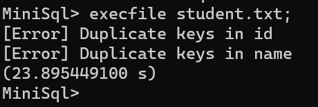

为了验证语法检查的功能，我做了错误测试：

下图是插入了值的数量不对等的元组。

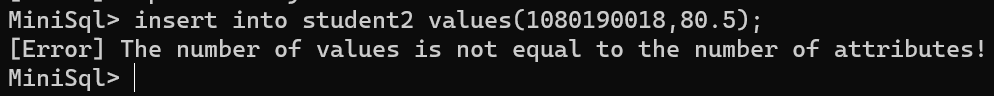

下图是插入的属性和表中不相同

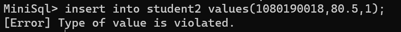

表不存在

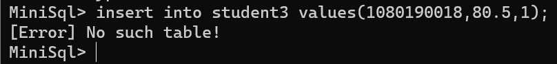

语法错误

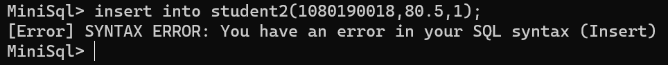

插入字符串长于表中的规定

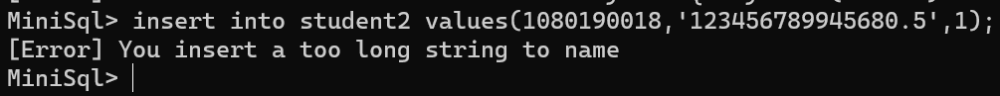


#### 3、查询测试

采用的不同查询指令来测试查找。

默认在有索引下查找：

查找条件的记录并不存在

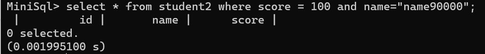

有记录符合

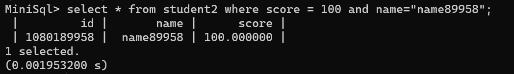

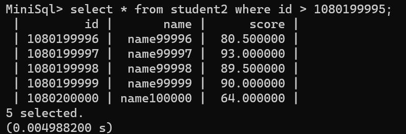


复杂条件查询（查询各条件）：

实现or连接


and连接

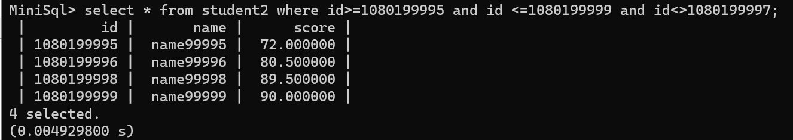

下面是删除索引后的查询。

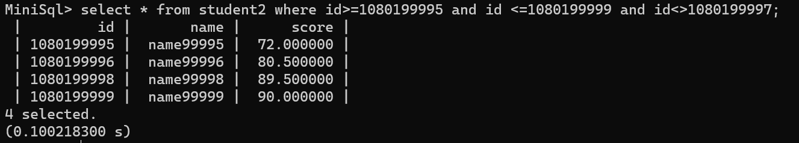

可见同样的查询时间翻了250倍左右，可见索引优化查找的效果。

下面进行一些错误命令测试：

查找不存在的属性

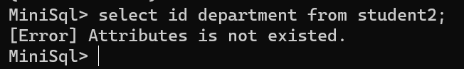

不存在的表

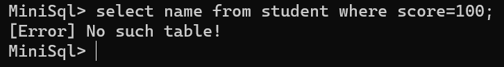

语法错误

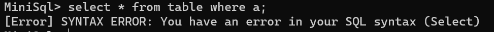


#### 4、删除测试

删除其中一条记录，条件为name=’name90000‘。

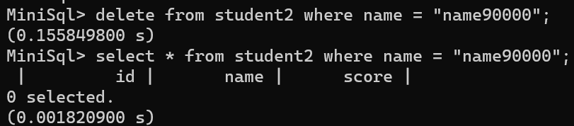

删除一定范围内的记录。

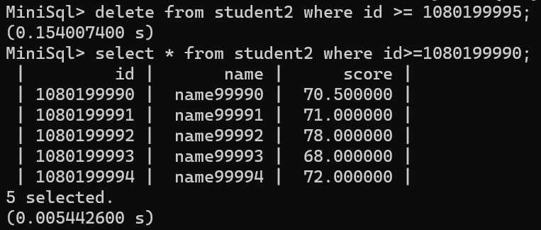

错误指令测试：

无所指向表：

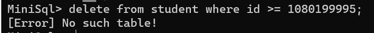

语法错误：


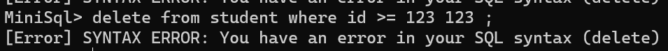


#### 5、索引创建和删除测试

创建索引：

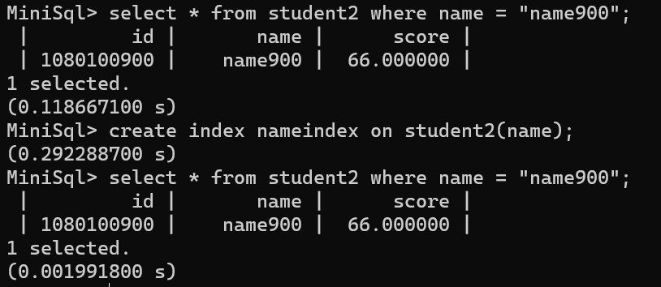

通过对比创建索引的前后时间可知索引建立成功。

删除索引成功

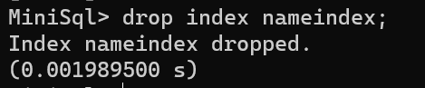

错误指令测试：

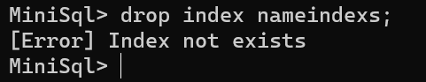

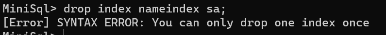


#### 6、删除表测试

删除表后找不到数据，删除成功

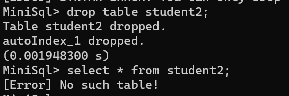

又建了一个表做测试删除

​                       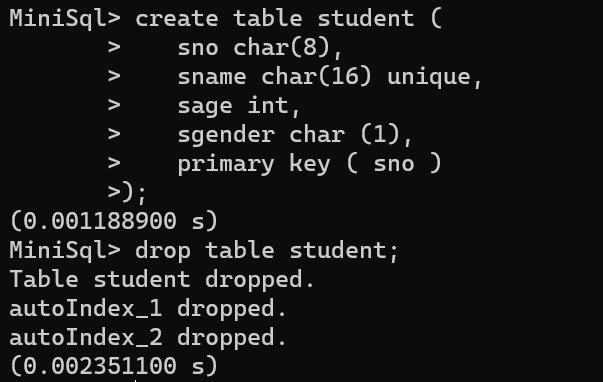    		、

删除成功


## Chapter 5 - 总结

